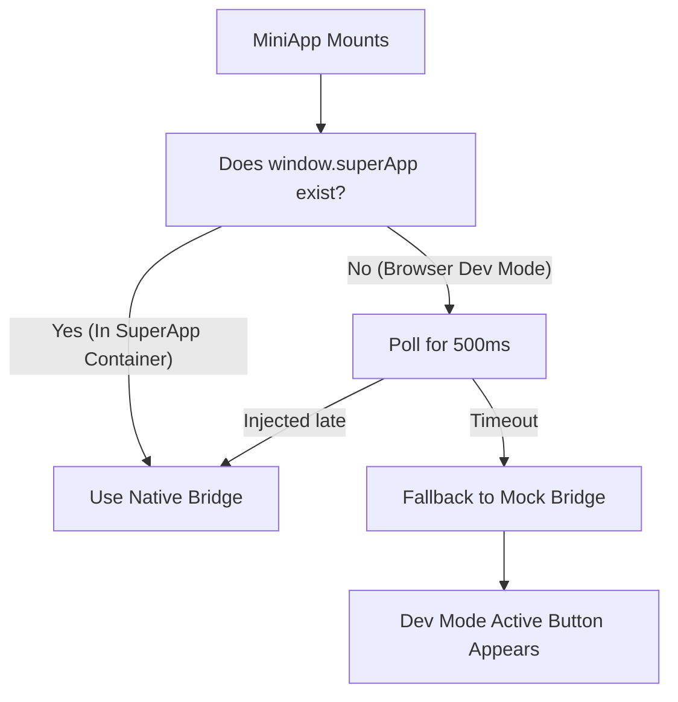

# MiniApp Boilerplate (React + TypeScript + Vite + TailwindCSS v4)

A clean, production-ready starter template for building custom mini-apps integrated with the SuperApp. 

This boilerplate contains pre-configured type definitions, automatic bridge polling and resolution logic, fallback developer tools for standalone browser environments, and structured conventions for UI components, state management, and routing.

---

## ⚡ Quick Start

### 1. Clone & Install Dependencies
First, install all development dependencies:
```bash
npm install
```

### 2. Configure Environment Variables
Copy the template environment configuration file to `.env`:
```bash
cp .env.example .env
```
Inside `.env`, customize the variables:
- **`VITE_DEV_AUTH_TOKEN`**: Paste a test JSON Web Token (JWT) here to execute authenticated backend API requests in standalone mode.
- **`VITE_DEV_API_BASE_URL`**: Set the base target URL of your local or remote backend server.

### 3. Start Development Server
Launch the local Vite server:
```bash
npm run dev
```

---

## 🔌 How the SuperApp Bridge Works

The mini-app interacts with the native container using a JavaScript/TypeScript bridge injected under `window.superApp`.



- **In the Native Container**: The bridge resolves immediately or within milliseconds. Standard JWT tokens are automatically requested from the parent shell using `superApp.getAuthToken()`.
- **In the Standalone Browser**: The bridge resolution falls back to a **Mock Bridge** after 500ms. A floating **🛠️ Dev Mode Active** console button is displayed at the bottom of the screen to simulate scan actions, show dialogs, generate native-like alerts, and swap test JWTs on-the-fly.

---

## 📁 Folder Structure

```
├── assets/fonts/                  # Kantumruy Pro font asset (Cambodian standard)
├── src/
│   ├── components/
│   │   ├── dev/
│   │   │   └── DevPanel.tsx       # Floating Developer Bridge Console
│   │   └── ui/                    # Reusable primitive UI components
│   │       ├── EmptyState.tsx     # Generic empty query display
│   │       ├── ErrorState.tsx     # Generic error banner with retry handler
│   │       └── Spinner.tsx        # Standardized loading indicator
│   ├── hooks/
│   │   ├── useSuperApp.ts         # Bridge resolution hook
│   │   └── useApiQuery.ts         # React Query example hooks template
│   ├── pages/
│   │   └── HomePage.tsx           # Dashboard demonstrating all bridge APIs
│   ├── services/
│   │   ├── api/
│   │   │   └── http-client.ts     # Generic HTTP request wrappers with Auth headers
│   │   └── bridge/
│   │       ├── bridge-factory.ts  # Bridge resolver polling engine
│   │       └── mock-bridge.ts     # Standalone mock implementation definitions
│   ├── store/
│   │   └── appStore.ts            # Global Zustand navigation and bridge store
│   ├── styles/
│   │   └── index.css              # Custom font rules, Tailwind imports & CSS resets
│   ├── types/
│   │   └── bridge.ts              # Native bridge type declarations (SuperAppBridge)
│   ├── utils/
│   │   └── format.ts              # Clean formatting helpers
│   ├── App.tsx                    # Core app wrapping QueryClient, stores, & views
│   └── main.tsx                   # React DOM entry point
```

---

## 🛠️ Developing Your Mini App

### Adding a New Page
1. Create your page component in `src/pages/` (e.g. `src/pages/DashboardPage.tsx`).
2. Register the page identifier in the Zustand `appStore.ts`:
   ```typescript
   // src/store/appStore.ts
   // Extend the view types if needed
   view: 'home' | 'dashboard' | 'settings';
   ```
3. Update `src/App.tsx` router view switcher:
   ```tsx
   {view === 'home' && <HomePage />}
   {view === 'dashboard' && <DashboardPage />}
   ```
4. Navigate dynamically by calling `pushView('dashboard')` or returning via `popView()`.

### Invoking backend API endpoints
1. Make authenticated API queries from hooks or components using `request()`:
   ```typescript
   import { request } from '../services/api/http-client';
   
   const data = await request('/api/v1/user/details', {}, token);
   ```
2. Vite is configured to proxy all local requests to `/api/*` and `/services/*` to your `VITE_DEV_API_BASE_URL` target inside `vite.config.ts`.

---

## 📦 Build & Package for Deployment

### 1. Build Production Assets
Compile TypeScript and bundle code:
```bash
npm run build
```
This produces a static, single-chunk bundle inside the `dist/` directory.

### 2. Package to Zip
Compress the contents of the `dist/` folder:

- **macOS / Linux**:
  ```bash
  npm run zip
  ```
- **Windows (PowerShell)**:
  ```powershell
  Compress-Archive -Path dist\* -DestinationPath dist.zip -Force
  ```

Upload the resulting `dist.zip` to the SuperApp Mini-App registry or sideload it to test locally inside the device native folder.
